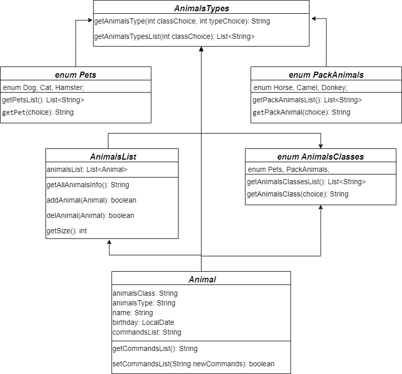
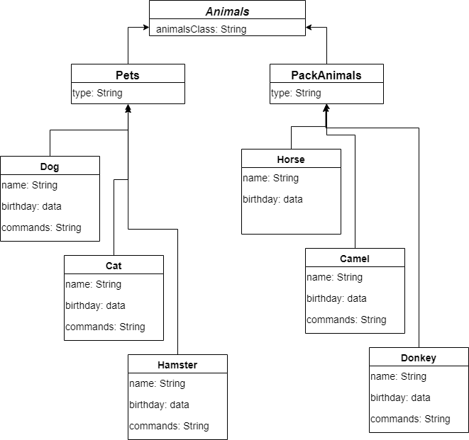

### Данная диаграмма классов описывает решение задания в Java:

   

### Данная диаграмма классов описывает решение задания в MySQL:

Причина создания такой диаграммы обусловлена всего лишь одним требованием в задании:
   - Удалить записи о верблюдах и объединить таблицы лошадей и ослов.

Фактически, необходимости в создании отдельных таблиц для различных видов животных не требуется!!! Абсолютно все задания можно решить, создав таблицы (классы) как отображено на диаграмме классов расположенной выше.
А вот фраза "обьеденить таблицы"... в задании по MySQL слишком явно требует создать такую диаграмму: 

   

