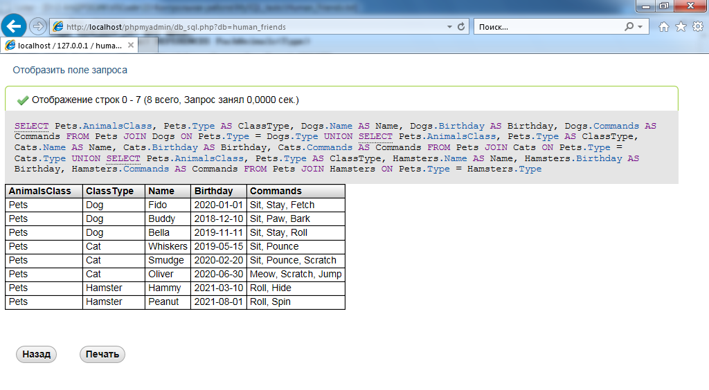

### Директрия содержит файлы:

   * Human_Friends.sql

      Содержит листинг команд (запросов) в формате удобном для загрузки в графические клиенты для работы с сервером MySQL: 
      - MySQL Workbench
      - PhpMyAdmin

   * Human_Friends.txt

      Содержит листинг команд (запросов) в формате текстового файла 

#### В директории *./images* содержатся скрины работы с базой данных через веб-интерфейс PhpMyAdmin:

Общий вид интерфейса

   

Заполненые таблицы с данными о животных, их командами и датами рождения:

   

   

Результат удаления записи о верблюдах и объединения таблиц лошадей и ослов

   

Временную таблицу VIEW со всеми животными

   

Новая таблица для животных в возрасте от 1 до 4!!! лет и их возраст с точностью до месяца

   

Объединение всех созданных таблиц в одну, сохраняя информацию о принадлежности к исходным таблицам

   
